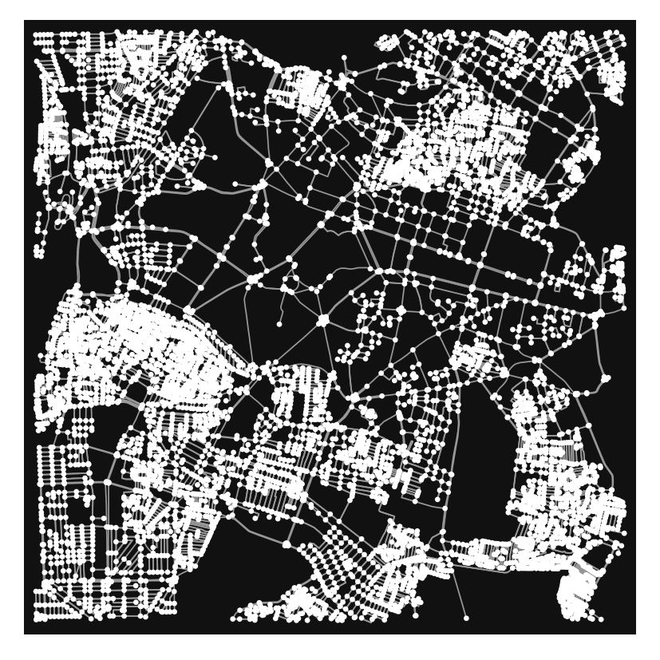
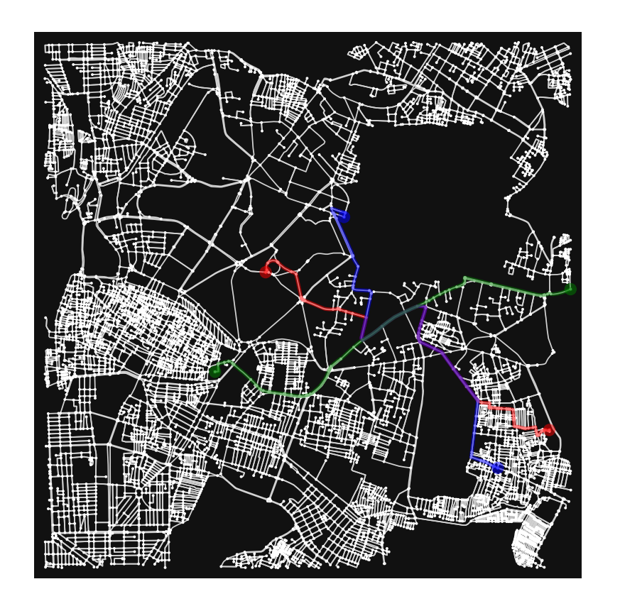

# Vayumarg-1

**Vayumarg-1** is a prototype Urban Air Mobility (UAM) and drone route planning system built using `osmnx`, `networkx`, `shapely`, and `matplotlib`.

The project evaluates multiple air taxi flight requests, checks battery feasibility, detects route conflicts, applies basic conflict resolution, and visualizes planned routes over a real-world road network.

The long-term vision of Vayumarg is to develop an intelligent, scalable, and accessible system for UAM and drone technology that can support safer aerial transportation, route planning, and airspace management.

> This is the first version of the project. More updates, improvements, and advanced features will be added in future versions.

---

## Table of Contents

- [Project Overview](#project-overview)
- [Vision](#vision)
- [Key Features](#key-features)
- [Requirements](#requirements)
- [Installation](#installation)
- [Usage](#usage)
- [Expected Output](#expected-output)
- [Visualizations](#visualizations)
- [Project Structure](#project-structure)
- [Current Status](#current-status)
- [Planned Future Updates](#planned-future-updates)
- [GitHub Push Steps](#github-push-steps)

---

## Project Overview

Vayumarg-1 loads a real-world road network around a selected city center using `osmnx`, simplifies the graph, removes nodes inside a defined No-Fly Zone (NFZ), and plans routes for multiple air taxi or drone requests.

Each flight request is evaluated based on:

- shortest route based on travel time
- battery feasibility
- route conflict detection
- same-path and crossing-path classification
- conflict resolution using delay or altitude separation
- final route visualization

Although the current version uses a road network as the base graph, the concept is designed as a foundation for future drone corridors, UAM air routes, and intelligent aerial traffic management.

---

## Vision

The goal of Vayumarg is to build a useful system for future UAM and drone technology.

The larger vision includes:

- safer drone and air taxi route planning
- intelligent airspace conflict detection
- better visualization of aerial mobility routes
- support for emergency, delivery, and passenger drone operations
- future-ready tools for smart cities and aerial transport systems

Vayumarg-1 is the starting prototype for this broader idea.

---

## Key Features

- Build a directed drivable graph from OpenStreetMap
- Simplify the graph and keep the largest strongly connected component
- Define a No-Fly Zone polygon and remove restricted nodes
- Compute travel time using a drone speed model
- Process multiple air taxi flight requests
- Match each origin and destination to the nearest graph node
- Accept or reject flights based on battery feasibility
- Detect route conflicts:
  - same-path conflicts
  - crossing-path conflicts
- Resolve conflicts using:
  - time delay
  - altitude separation
- Generate a single visualization showing all accepted routes

---

## Requirements

- Python 3.8+
- `osmnx`
- `networkx`
- `shapely`
- `matplotlib`

Install dependencies with:

```bash
pip install osmnx networkx shapely matplotlib

Paste this after your **Requirements** section. I added space for your two photos: one city map and one routing output.

```markdown
---

## Installation

Clone the repository:

```bash
git clone https://github.com/YOUR_USERNAME/vayumarg-1.git
cd vayumarg-1
```

Create a virtual environment:

```bash
python -m venv venv
```

Activate the virtual environment:

```bash
# Windows
venv\Scripts\activate
```

```bash
# macOS/Linux
source venv/bin/activate
```

Install the required dependencies:

```bash
pip install osmnx networkx shapely matplotlib
```

---

## Usage

Run the Python script:

```bash
python air_taxi_simulation.py
```

The program will:

1. Load a real-world city road network.
2. Simplify the graph for routing.
3. Apply a No-Fly Zone restriction.
4. Remove nodes that fall inside the restricted zone.
5. Process multiple air taxi requests.
6. Find shortest routes based on travel time.
7. Check whether each taxi has enough battery.
8. Detect route conflicts between accepted flights.
9. Resolve conflicts using time delay or altitude separation.
10. Display the final route visualization.

---

## City Map

The project uses real-world map data around Bengaluru, India. The city network is extracted using OpenStreetMap data through `osmnx`.

Add your city map image here:



Example folder path:

```text
assets/city_map.png
```

---

## Route Visualization

The final visualization shows all accepted air taxi routes on the graph.

The route map includes:

- light gray road network
- colored routes for different air taxis
- green circles for origins
- red X markers for destinations

Add your routing image here:



Example folder path:

```text
assets/route_visualization.png
```

---

## Saving Visual Output

To save the generated route visualization, add this line before `plt.show()` in the Python file:

```python
plt.savefig("assets/route_visualisation.png", dpi=300, bbox_inches="tight")
plt.show()
```

Create an `assets` folder before running the script:

```bash
mkdir assets
```

Then run:

```bash
python air_taxi_simulation.py
```

---

## Expected Output

The program displays graph information, accepted or rejected taxis, detected conflicts, conflict resolution steps, and the final flight summary.

Example output format:

```text
Raw nodes: 1234
After simplification: 980
Final nodes: 940
Final edges: 2140
Removing NFZ nodes: 42

Processing Taxi 1
Taxi 1 | Route time = 420.0s | Battery allows = 1440.0s
✅ Taxi 1 accepted

Detected SAME_PATH_CONFLICT between Taxi 1 and Taxi 2, shared_nodes=18, ratio=0.85
 SAME_PATH_CONFLICT resolved: Taxi 2 delayed by 30.0 seconds

--- FINAL FLIGHT SUMMARY ---
Taxi 1 | ON TIME | Total Time: 420.0s
Taxi 2 | DELAYED 30.0s | Total Time: 450.0s
```

Actual values can change depending on OpenStreetMap data, selected location, no-fly zone boundaries, and graph availability.

---

## How It Works

### 1. Graph Creation

The project uses `osmnx` to download a real-world road network around the selected center point.

```python
center_point = (12.9716, 77.5946)
```

The graph is downloaded within a fixed distance around this point and then simplified.

### 2. No-Fly Zone Handling

A No-Fly Zone is created using a polygon. Nodes inside this restricted area are removed from the graph.

This helps simulate airspace restrictions where drones or air taxis should not pass.

### 3. Travel Time Calculation

Each graph edge is assigned a travel time based on distance and drone speed.

```python
travel_time = length / DRONE_SPEED
```

### 4. Battery Feasibility

Each air taxi has a battery percentage. The system checks whether the available battery can support the required travel time.

Flights with insufficient battery are rejected.

### 5. Conflict Detection

The system compares accepted routes and detects possible conflicts.

Two types of conflicts are considered:

- `SAME_PATH_CONFLICT`
- `CROSSING_PATH_CONFLICT`

### 6. Conflict Resolution

Conflicts are resolved using simple rules:

- same-path conflicts are handled using time delay
- crossing-path conflicts are handled using altitude separation

---

## Current Status

Vayumarg-1 is currently an initial prototype.

The present version demonstrates the core idea of a UAM and drone route planning system. It includes route generation, No-Fly Zone avoidance, battery validation, conflict detection, conflict resolution, and visualization.

More development is remaining. Future versions will focus on improving realism, scalability, safety, and practical use for drone and air taxi systems.

---

## Planned Future Updates

The following improvements are planned for future versions:

- use drone-specific aerial corridors instead of road-based graph routing
- improve conflict detection using edge-level timing
- add better altitude management for multiple drones
- add weather and wind conditions
- add emergency landing zone detection
- improve the battery model using payload, speed, altitude, and distance
- support emergency, medical, delivery, and passenger drone categories
- add priority-based scheduling
- export flight summaries to CSV or JSON
- support larger city-scale simulations
- build a user-friendly interface for non-technical users
- add real-time monitoring support
- improve route safety scoring

---

## Project Structure

```text
vayumarg-1/
│
├── air_taxi_simulation.py
├── README.md
├── requirements.txt
│
└── assets/
    ├── city_map.png
    └── route_visualization.png
```

---

## Applications

Vayumarg-1 can be extended for different UAM and drone technology use cases, such as:

- urban air taxi route planning
- drone delivery route management
- emergency medical drone routing
- no-fly zone avoidance
- smart city aerial mobility planning
- drone traffic monitoring
- future airspace management systems

---

## Limitations

The current version is a prototype and has some limitations:

- it uses road networks as a base instead of real aerial corridors
- the battery model is simplified
- weather, wind, payload, and altitude effects are not fully modeled
- conflict detection is basic
- route planning is not yet real-time
- visualization is static and not interactive

These limitations will be improved in future versions.

---

## GitHub Push Steps

Initialize Git:

```bash
git init
```

Add all files:

```bash
git add .
```

Commit the project:

```bash
git commit -m "Initial version of Vayumarg-1"
```

Create a new repository on GitHub named:

```text
vayumarg-1
```

Connect your local project to GitHub:

```bash
git remote add origin https://github.com/YOUR_USERNAME/vayumarg-1.git
```

Push your project:

```bash
git branch -M main
git push -u origin main
```

---

## License

This project is currently developed as a prototype for learning, research, and future UAM system development.

A suitable open-source license such as the MIT License can be added in future versions.

---

## Author

Developed by **Prajash Patel**

Project: **Vayumarg-1**

Purpose: Building an early prototype for future UAM, drone route planning, and intelligent aerial mobility systems.
```
